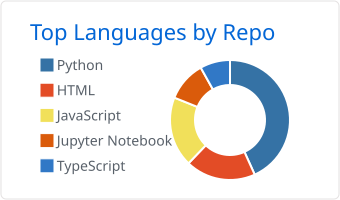
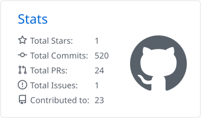
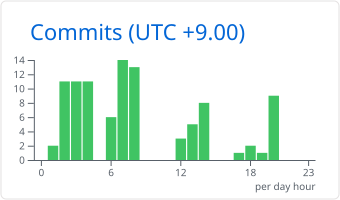

### Hi there 👋

AIエンジニア / LLM・NLP・機械学習を中心に、プロダクト開発からプロンプトエンジニアリングまで。

### 🛠 Tech Stack

**Languages / ML** 
  

**AI** 
   

**Infra / Tools** 
    

### 🚀 Featured Projects

| Project | 概要 |
|:--|:--|
| [**llm-finetune**](https://github.com/yamadan96/llm-finetune) | LoRA をスクラッチ実装し、Qwen2.5-7B を日本語の指示データでファインチューニング |
| [**vit-from-scratch**](https://github.com/yamadan96/vit-from-scratch) | Vision Transformer を PyTorch でスクラッチ実装し、論文を再現（CIFAR-10 で学習） |
| [**local-claude-code**](https://github.com/yamadan96/local-claude-code) | ローカル LLM（Ollama / vLLM など）で動くコーディングエージェント CLI。ツール実行・サンドボックス・権限制御を自作（テスト 159 件） |
| [**disaster-app**](https://github.com/yamadan96/disaster-app) | 被災建物の写真から損傷度を判定する WebApp（研究で作った DINOv2 + LoRA モデルをデプロイ） |

### 📊 GitHub Stats

<!-- Cards follow the viewer's light/dark theme -->

  <picture>
    <source media="(prefers-color-scheme: dark)" srcset="./profile-summary-card-output/github_dark/0-profile-details.svg" />
    
  </picture>

  <picture>
    <source media="(prefers-color-scheme: dark)" srcset="./profile-summary-card-output/github_dark/1-repos-per-language.svg" />
    
  </picture>
  <picture>
    <source media="(prefers-color-scheme: dark)" srcset="./profile-summary-card-output/github_dark/2-most-commit-language.svg" />
    
  </picture>

  <picture>
    <source media="(prefers-color-scheme: dark)" srcset="./profile-summary-card-output/github_dark/3-stats.svg" />
    
  </picture>
  <picture>
    <source media="(prefers-color-scheme: dark)" srcset="./profile-summary-card-output/github_dark/4-productive-time.svg" />
    
  </picture>

