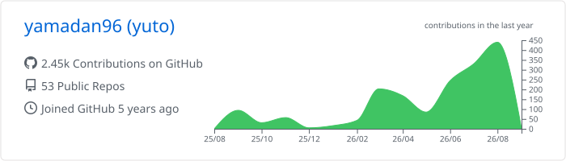

### Hi there 👋

AIエンジニアとして、LLM・AIエージェント・Computer Vision のモデル実装からプロダクトへの組み込みまで取り組んでいます。

 

### 🛠 Tech Stack

**Python** · **PyTorch** · **TypeScript** 
LLM · RAG · LLM Agents · Computer Vision 
Docker · AWS · GCP · Azure

### 🚀 Featured Projects

#### [llm-finetune](https://github.com/yamadan96/llm-finetune)
LoRA from scratch · Qwen2.5-7B · PyTorch

#### [vit-from-scratch](https://github.com/yamadan96/vit-from-scratch)
Vision Transformer from scratch · CIFAR-10

#### [local-claude-code](https://github.com/yamadan96/local-claude-code)
Local LLM Coding Agent · Tool Calling · 167 tests

#### [disaster-app](https://github.com/yamadan96/disaster-app)
DINOv2-based disaster damage classification WebApp

### 📊 GitHub

<!-- Contributions, public repos and account age; regenerated monthly by the workflow. Follows light/dark theme. -->
<picture>
  <source media="(prefers-color-scheme: dark)" srcset="./profile-summary-card-output/github_dark/0-profile-details.svg" />
  
</picture>
